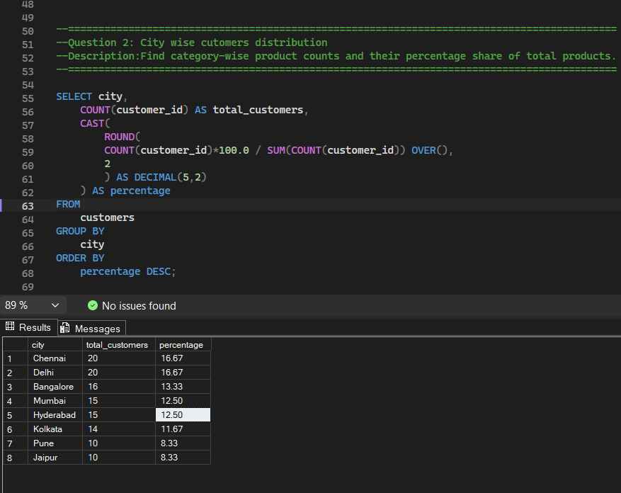
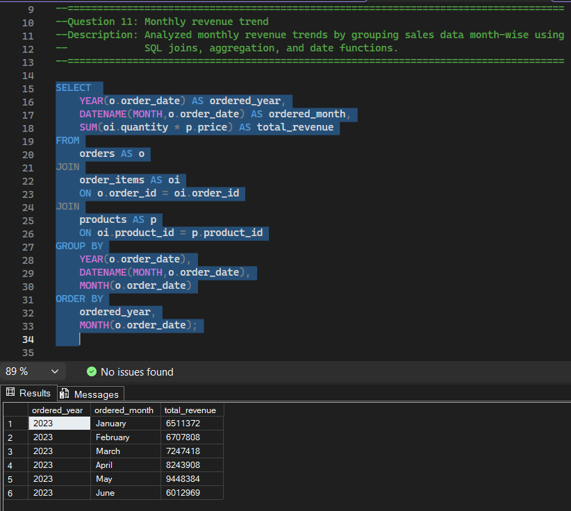
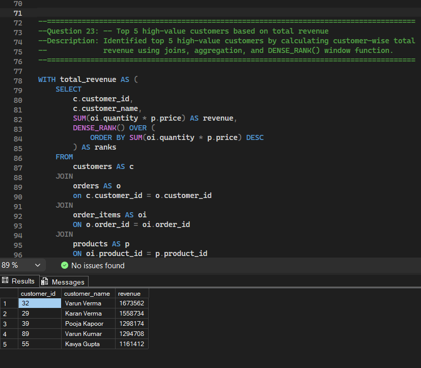
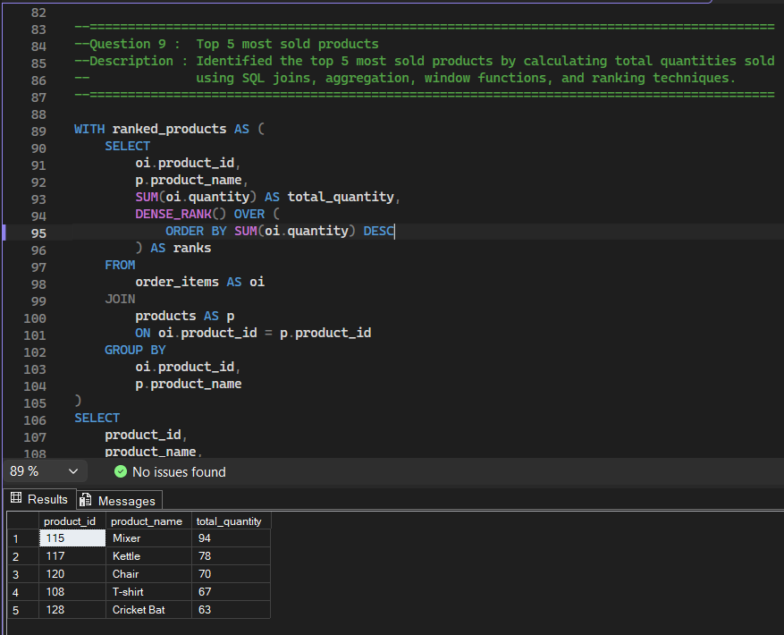
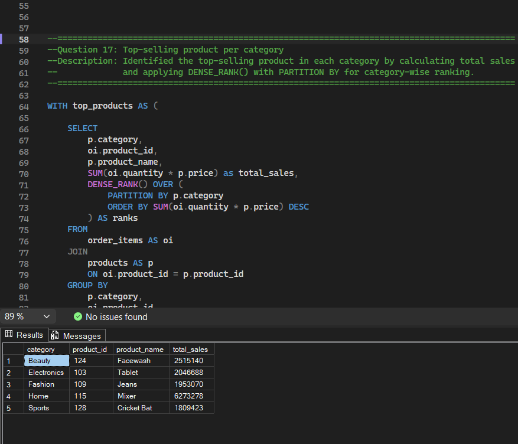

# 🛒 E-Commerce Sales Analysis using SQL

## 📌 Project Overview

This project analyzes an E-Commerce dataset using Microsoft SQL Server to answer real-world business questions related to customers, products, orders, and revenue.

The objective was to transform raw transactional data into actionable business insights using SQL queries and analytical thinking.

---

## 🎯 Business Problems Solved

- Identified top revenue-generating customers
- Analyzed monthly sales performance trends
- Discovered the most sold products
- Evaluated customer distribution across cities
- Ranked top-performing products within each category

---

## 🛠️ Tools & Technologies

* Microsoft SQL Server
* SQL
* Git & GitHub

---

## 🧠 SQL Concepts Demonstrated

`SELECT`
`WHERE`
`ORDER BY`
`GROUP BY`
`HAVING`
`JOINS`
`AGGREGATIONS`
`CASE`
`CTEs`
`WINDOW FUNCTIONS`
`RANK()`
`DENSE_RANK()`
`ROW_NUMBER()`

---

## 📊 Key Insights

### 👥 Customer Analysis

* Identified high-value customers contributing the highest revenue.
* Analyzed customer distribution across different cities.

### 📦 Product Analysis

* Discovered the most sold products.
* Identified top-performing products within each category.

### 💰 Revenue Analysis

* Evaluated monthly revenue trends.
* Highlighted sales patterns and business performance over time.

---

## 📸 Project Highlights

### Customer Distribution by City




### Monthly Revenue Trend




### Top 5 High-Value Customers




### Top 5 Most Sold Products




### Top-Selling Product per Category



---

## 📂 Repository Structure

```text
sql-e-commerce-analysis-project
│
├── datasets
├── screenshots
├── sql_queries
└── README.md
```

---

## 👨‍💻 Author

Sagar Bairwa

B.Tech CSE Student | Aspiring Data Analyst

📍 Haryana, India

🔗 GitHub: https://github.com/sagar-bairwa

🔗 LinkedIn: www.linkedin.com/in/sagarbairwa
